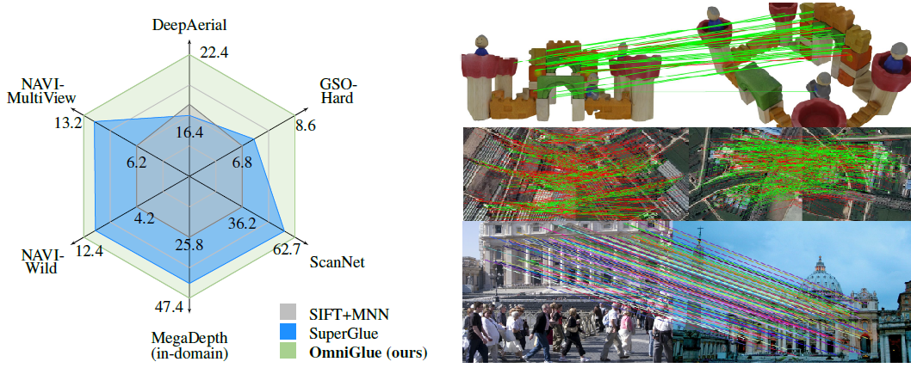
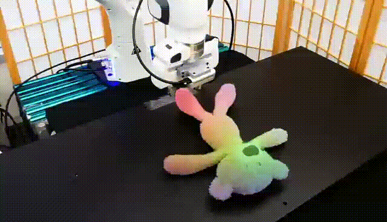
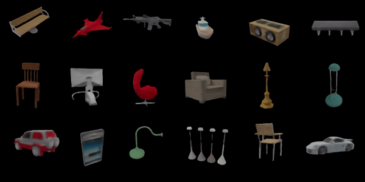
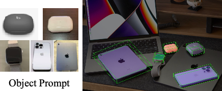
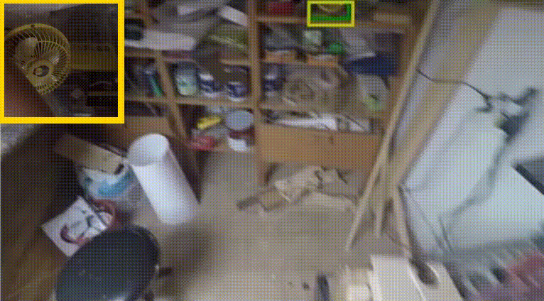
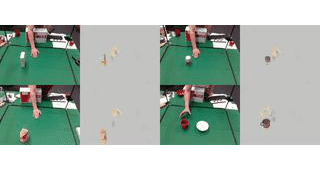

(* equal contribution)
<dl><dt></dt><dt>OmniGlue: Generalizable Feature Matching with Foundation Model Guidance</dt><dd><strong>Hanwen Jiang</strong>, Arjun Karpur, Bingyi Cao, Qixing Huang, Andre Araujo</dd><dd>Conference on Computer Vision and Pattern Recognition (<strong>CVPR</strong>), 2024.</dd><dd>  <a href="https://github.com/google-research/omniglue">[Project page]</a>, <a href="https://arxiv.org/abs/2405.12979">[Paper]</a> </dd></dl>

<dl><dt></dt><dt> LEAP: Liberate Sparse-view 3D Modeling from Camera Poses</dt><dd> <strong>Hanwen Jiang</strong>, Zhenyu Jiang, Yue Zhao, Qixing Huang</dd><dd>International Conference on Learning Representations (<strong>ICLR</strong>), 2024. </dd><dd>  <a href="https://hwjiang1510.github.io/LEAP/">[Project page]</a>, <a href="https://arxiv.org/pdf/2310.01410.pdf">[Paper]</a> </dd></dl>

<dl><dt></dt><dt>Doduo: Learning Dense Visual Correspondence from Unsupervised Semantic-Aware Flow</dt><dd>Zhenyu Jiang, <strong>Hanwen Jiang</strong>, Yuke Zhu</dd><dd>International Conference on Robotics and Automation (<strong>ICRA</strong>), 2024.</dd><dd>  <a href="https://ut-austin-rpl.github.io/Doduo/">[Project page]</a>, <a href="https://arxiv.org/pdf/2309.15110.pdf">[Paper]</a> </dd></dl>

<dl><dt></dt><dt> Few-View Object Reconstruction with Unknown Categories and Camera Poses</dt><dd> <strong>Hanwen Jiang</strong>, Zhenyu Jiang, Kristen Grauman, Yuke Zhu</dd><dd>International Conference on 3D Vision (<strong>3DV</strong>), 2024 <strong style="color: red;">(Oral, Best Paper Candidate)</strong></dd><dd>  <a href="https://ut-austin-rpl.github.io/FORGE/">[Project page]</a>, <a href="https://arxiv.org/pdf/2212.04492.pdf">[Paper]</a> </dd></dl>

<dl><dt></dt><dt> POPE: 6-DoF Promptable Pose Estimation of Any Object, in Any Scene, with One Reference</dt><dd>Zhiwen Fan, Panwang Pan, et al.</dd><dd>ArXiv, 2023</dd><dd>  <a href="https://paulpanwang.github.io/POPE/">[Project page]</a>, <a href="https://arxiv.org/pdf/2305.15727.pdf">[Paper]</a> </dd></dl>

<dl><dt></dt><dt> Single-Stage Visual Query Localization in Egocentric Videos</dt><dd> <strong>Hanwen Jiang</strong>, Santhosh Ramakrishnan, Kristen Grauman</dd><dd>Advances in Neural Information Processing Systems (<strong>NeurIPS</strong>), 2023.</dd><dd><strong>Winner</strong> of Ego4D VQ2D challenge 2023. </dd><dd>  <a href="https://hwjiang1510.github.io/VQLoC/">[Project page]</a>, <a href="https://arxiv.org/abs/2306.09324">[Paper]</a> </dd></dl>

<dl><dt></dt><dt> DexMV: Imitation Learning for Dexterous Manipulation from Human Videos</dt><dd> Yuzhe Qin*, Yueh-Hua Wu*, Shaowei Liu, <strong>Hanwen Jiang</strong>, Ruihan Yang, Yang Fu, Xiaolong Wang</dd><dd>European Conference on Computer Vision (<strong>ECCV</strong>), 2022</dd><dd>  <a href="https://github.com/yzqin/dexmv-sim">[Code]</a>, <a href="https://yzqin.github.io/dexmv/">[Project page]</a>, <a href="https://arxiv.org/pdf/2108.05877.pdf">[Paper]</a> </dd></dl>

<dl><dt></dt><dt> Hand-Object Contact Consistency Reasoning for Human Grasps Generation</dt><dd><strong>Hanwen Jiang*</strong>, Shaowei Liu*, Jiashun Wang, Xiaolong Wang</dd><dd>International Conference on Computer Vision (<strong>ICCV</strong>), 2021 <strong style="color: red;">(Oral)</strong> </dd><dd> <a href="https://github.com/hwjiang1510/GraspTTA">[Code]</a>, <a href="https://hwjiang1510.github.io/GraspTTA/">[Project page]</a>, <a href="https://arxiv.org/pdf/2104.03304.pdf">[Paper]</a> </dd></dl>

<dl><dt></dt><dt> Semi-Supervised 3D Hand-Object Poses Estimation with Interactions in Time</dt><dd>Shaowei Liu*, <strong>Hanwen Jiang*</strong>, Jiarui Xu, Sifei Liu, Xiaolong Wang</dd><dd>Conference on Computer Vision and Pattern Recognition (<strong>CVPR</strong>), 2021 </dd> <dd><a href="https://github.com/stevenlsw/Semi-Hand-Object">[Code]</a>, <a href="https://stevenlsw.github.io/Semi-Hand-Object/">[Project page]</a>, <a href="https://arxiv.org/pdf/2106.05266.pdf">[Paper]</a> </dd>  </dl>

<dl><dt></dt><dt> Robust Lane Detection from Continuous Driving Scenes Using Deep Neural Networks</dt><dd>Qin Zou, <strong>Hanwen Jiang</strong>, Qiyu Dai, Yuanhao Yue, Long Chen, Qian Wang</dd><dd>IEEE Transactions on Vehicular Technology (<strong>IEEE TVT</strong>), 2020 </dd><dd> <a href="https://github.com/qinnzou/Robust-Lane-Detection">[Code]</a>, <a href="https://arxiv.org/pdf/1903.02193.pdf">[Paper]</a></dd></dl>

