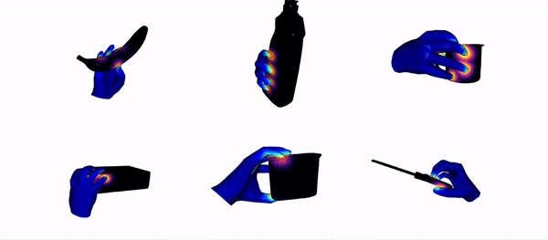
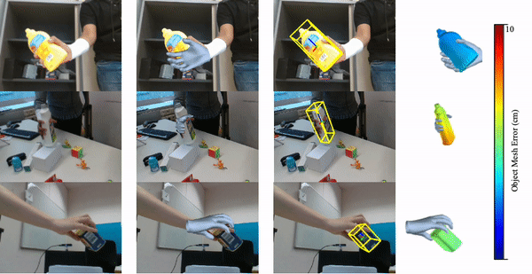
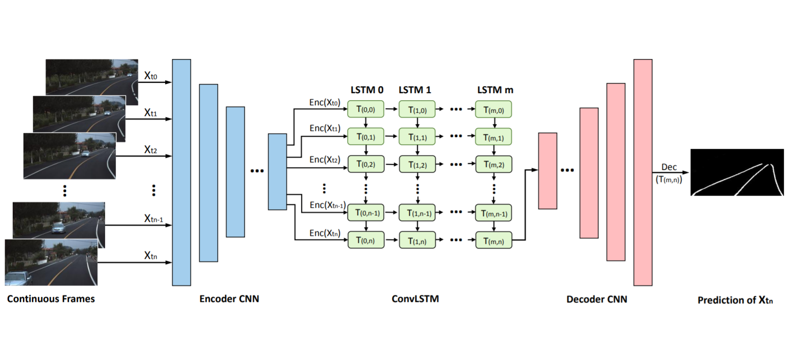

(* equal contribution)
<dl><dt></dt><dt> DexMV: Imitation Learning for Dexterous Manipulation from Human Videos</dt><dd> Yuzhe Qin*, Yueh-Hua Wu*, Shaowei Liu*, <strong>Hanwen Jiang*</strong>, Ruihan Yang, Yang Fu, Xiaolong Wang</dd><dd>Arxiv, 2021 </dd><dd> <a href="https://yzqin.github.io/dexmv/">[Project page]</a>, <a href="https://arxiv.org/pdf/2108.05877.pdf">[Paper]</a> </dd></dl>

<dl><dt></dt><dt> Hand-Object Contact Consistency Reasoning for Human Grasps Generation</dt><dd><strong>Hanwen Jiang*</strong>, Shaowei Liu*, Jiashun Wang, Xiaolong Wang</dd><dd>International Conference on Computer Vision (<strong>ICCV</strong>), 2021 <strong>(Oral Presentation)</strong> </dd><dd> <a href="https://hwjiang1510.github.io/GraspTTA/">[Project page]</a>, <a href="https://arxiv.org/pdf/2104.03304.pdf">[Paper]</a> </dd></dl>

<dl><dt></dt><dt> Semi-Supervised 3D Hand-Object Poses Estimation with Interactions in Time</dt><dd>Shaowei Liu*, <strong>Hanwen Jiang*</strong>, Jiarui Xu, Sifei Liu, Xiaolong Wang</dd><dd>Conference on Computer Vision and Pattern Recognition (<strong>CVPR</strong>), 2021 </dd> <dd><a href="https://github.com/stevenlsw/Semi-Hand-Object">[Code]</a>, <a href="https://stevenlsw.github.io/Semi-Hand-Object/">[Project page]</a>, <a href="https://arxiv.org/pdf/2106.05266.pdf">[Paper]</a> </dd>  </dl>

<dl><dt></dt><dt> Robust Lane Detection from Continuous Driving Scenes Using Deep Neural Networks</dt><dd>Qin Zou, <strong>Hanwen Jiang</strong>, Qiyu Dai, Yuanhao Yue, Long Chen, Qian Wang</dd><dd>IEEE Transactions on Vehicular Technology (<strong>IEEE TVT</strong>), 2020 </dd><dd> <a href="https://github.com/qinnzou/Robust-Lane-Detection">[Code]</a>, <a href="https://arxiv.org/pdf/1903.02193.pdf">[Paper]</a></dd></dl>

